# SKALA-SHOP API 실습평가 보고서

SKALA-SHOP API는 상품·고객·주문을 관리하는 온라인쇼핑몰 백엔드 REST API를 Controller-Service-Repository 계층 구조로 구현하는 실습평가 과제입니다. 상품/고객 CRUD, 로그인, 주문·취소 같은 기본 기능과 함께 장바구니, 주문 상세 및 내역 관리, 상품 리뷰·평점, 위시리스트, 카테고리 및 검색 같은 차별화 기능까지 구현했습니다.

---

## 1. 개요

### 1.1 아키텍처 (계층 구조)

```
com.skala.shopapi
 ├─ controller/   요청 인입점 (REST API)
 ├─ service/      비즈니스 로직
 ├─ repository/   JPA 데이터 접근
 ├─ entity/       JPA 엔티티 (테이블 매핑)
 ├─ dto/          요청/응답 전용 객체
 ├─ common/       Response, PagedList, SessionHandler (전 계층 공통)
 ├─ exception/    Error, ResponseException, ParameterException, GlobalExceptionHandler
 ├─ tools/        StringUtil 등 유틸리티
 ├─ aop/          ApiLoggingAspect (API 호출 로깅)
 └─ config/       JacksonConfig, H2ConsoleConfig, OpenApiConfig
```

요청은 `controller → service → repository → DB` 순으로 흐르며, `common`/`exception`은 전 계층에서 공통으로 사용됩니다. AOP가 모든 컨트롤러 호출을 가로채 요청/응답을 로깅합니다.

### 1.2 패키지 구성도

| 패키지          | 역할             | 주요 클래스                                                                                                                                                              |
| ------------ | -------------- | ------------------------------------------------------------------------------------------------------------------------------------------------------------------- |
| `entity`     | JPA 엔티티        | Product, Customer, OrderItem, CartItem, OrderHistory, Review, Wishlist, Category                                                                                    |
| `dto`        | 요청/응답 객체       | OrderItemDto, OrderListDto, OrderRequest, CustomerSession, CartItemDto, OrderHistoryDto, ReviewDto, ReviewListDto, WishlistItemDto, ProductIdRequest, ReviewRequest |
| `repository` | JPA Repository | ProductRepository, CustomerRepository, OrderItemRepository, CartItemRepository, OrderHistoryRepository, ReviewRepository, WishlistRepository, CategoryRepository    |
| `service`    | 비즈니스 로직        | ProductService, CustomerService, CartService, ReviewService, WishlistService, CategoryService                                                                       |
| `controller` | REST 엔드포인트     | ProductController, CustomerController, CartController, ReviewController, WishlistController, CategoryController                                                     |

### 1.3 최종 API 목록

**기본 기능**

| Method | URI                           | 설명                     |
| ------ | ----------------------------- | ---------------------- |
| GET    | `/api/products/list`          | 상품 목록 조회 (페이징)         |
| GET    | `/api/products/{id}`          | 상품 상세 조회               |
| POST   | `/api/products`               | 상품 등록                  |
| PUT    | `/api/products`               | 상품 정보 수정               |
| DELETE | `/api/products`               | 상품 삭제                  |
| GET    | `/api/customers/list`         | 고객 목록 조회 (페이징)         |
| GET    | `/api/customers/{customerId}` | 고객 상세 조회 (보유 주문상품 포함)  |
| POST   | `/api/customers`              | 회원가입 (초기 포인트 지급)       |
| PUT    | `/api/customers`              | 고객 정보 수정               |
| DELETE | `/api/customers`              | 고객 삭제                  |
| POST   | `/api/customers/login`        | 로그인 (세션 쿠키 발급)         |
| POST   | `/api/customers/order`        | 상품 주문 (로그인 필요, 포인트 차감) |
| POST   | `/api/customers/cancel`       | 주문 취소 (포인트 환급)         |

**차별화된 기능**

| Method | URI                                            | 설명                     |
| ------ | ---------------------------------------------- | ---------------------- |
| GET    | `/api/customers/cart`                          | 내 장바구니 조회              |
| POST   | `/api/customers/cart`                          | 장바구니 담기                |
| DELETE | `/api/customers/cart`                          | 장바구니 항목 제거             |
| POST   | `/api/customers/cart/checkout`                 | 장바구니 전체 주문 확정          |
| GET    | `/api/customers/{customerId}/orders`           | 주문/취소 이력 목록 조회 (시간 역순) |
| GET    | `/api/customers/{customerId}/orders/{orderId}` | 주문/취소 이력 상세 조회         |
| GET    | `/api/products/{productId}/reviews`            | 상품 리뷰 목록 조회 (평균 평점 포함) |
| POST   | `/api/products/{productId}/reviews`            | 상품 리뷰 작성 (구매 이력 필요)    |
| DELETE | `/api/reviews/{reviewId}`                      | 리뷰 삭제 (작성자만)           |
| GET    | `/api/customers/wishlist`                      | 내 위시리스트 조회             |
| POST   | `/api/customers/wishlist`                      | 위시리스트에 추가 (찜하기)        |
| DELETE | `/api/customers/wishlist`                      | 위시리스트에서 제거             |
| GET    | `/api/categories/list`                         | 카테고리 목록 조회             |
| GET    | `/api/categories/{id}`                         | 카테고리 상세 조회             |
| POST   | `/api/categories`                              | 카테고리 등록                |
| PUT    | `/api/categories`                              | 카테고리 수정                |
| DELETE | `/api/categories`                              | 카테고리 삭제                |
| GET    | `/api/products/search`                         | 상품 검색 (키워드/카테고리 조합)    |

---

## 2. 기본 기능

### 2.1 상품 관리 CRUD

상품명이 비어있거나 가격이 0 이하면 등록/수정을 거부하고, 상품명이 이미 존재하면 등록을 거부하는 검증 로직도 함께 적용했습니다. 상품 등록 → 등록된 상품이 실제로 조회되는지 확인 → 수정 → 반영 확인 → 삭제 → 삭제 후 404 확인 순으로 전체 CRUD 사이클을 검증했습니다.

**등록** `POST /api/products`
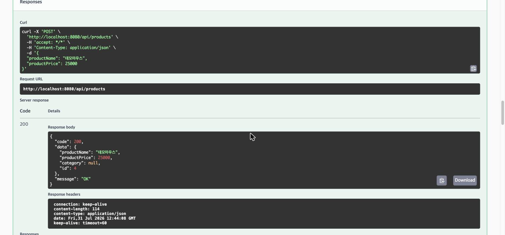

**등록 확인** `GET /api/products/{id}` — 응답의 `id:4`가 실제로 조회되었습니다.
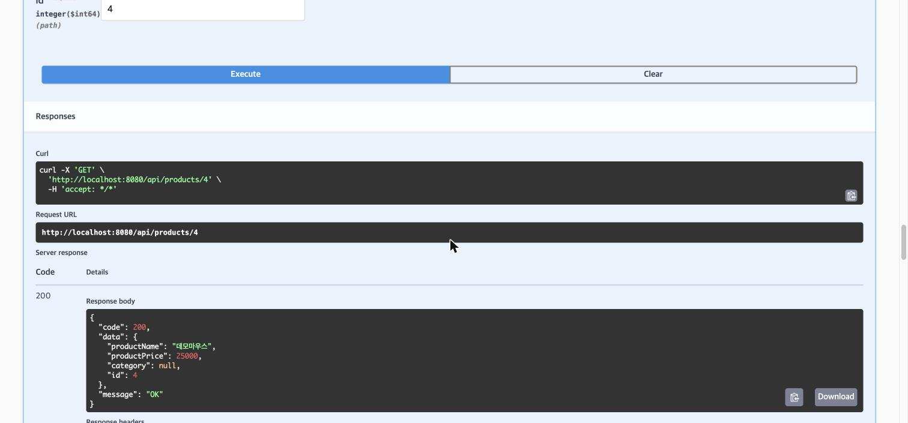

**수정** `PUT /api/products` (가격 25000 → 20000)
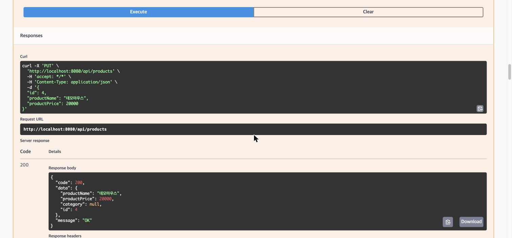

**수정 확인** `GET /api/products/{id}`
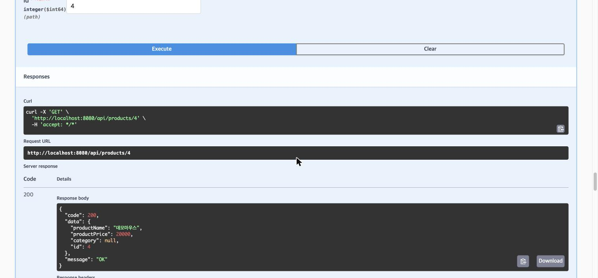

**삭제** `DELETE /api/products`
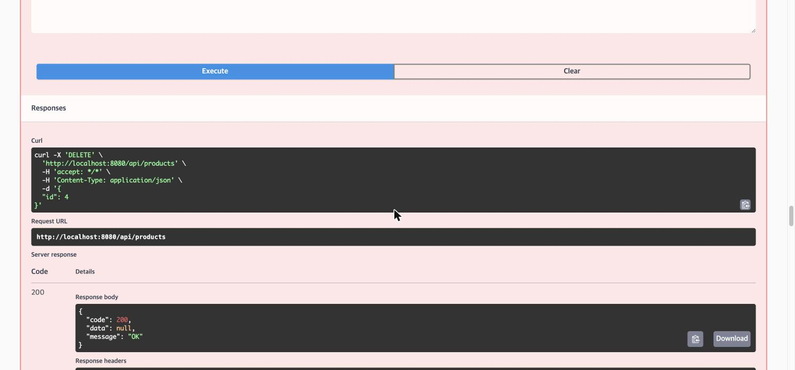

**삭제 확인** `GET /api/products/{id}` — 동일 id 재조회 시 `404 Data not found`가 반환되었습니다.
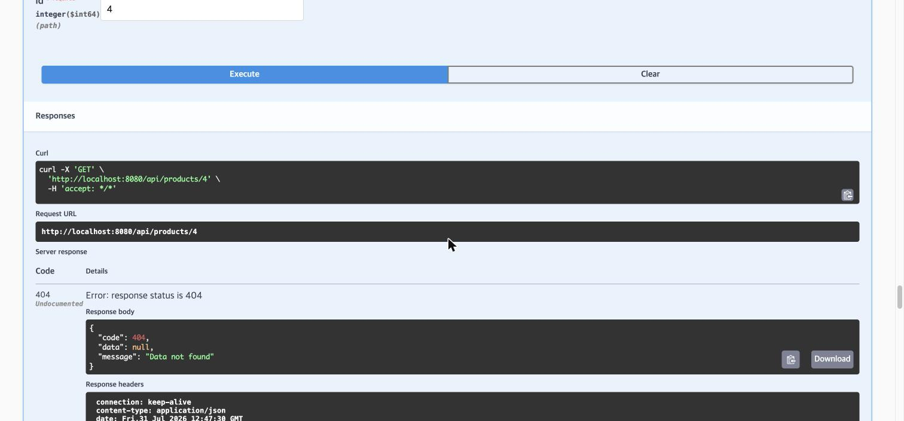

> 상품명이 비어있거나 가격이 0 이하면 `ParameterException`(400), 이름이 중복되면 `DATA_DUPLICATED`(409)로 거부되는 것도 별도로 검증했습니다 (스크린샷은 생략).

### 2.2 고객 관리 CRUD (회원가입 포함)

회원가입 시 비밀번호를 직접 입력받되 포인트는 시스템이 초기값(1,000,000)을 자동으로 지급하며, 이후 정보 수정·삭제가 실제로 반영되는지 확인했습니다.

**회원가입** `POST /api/customers`
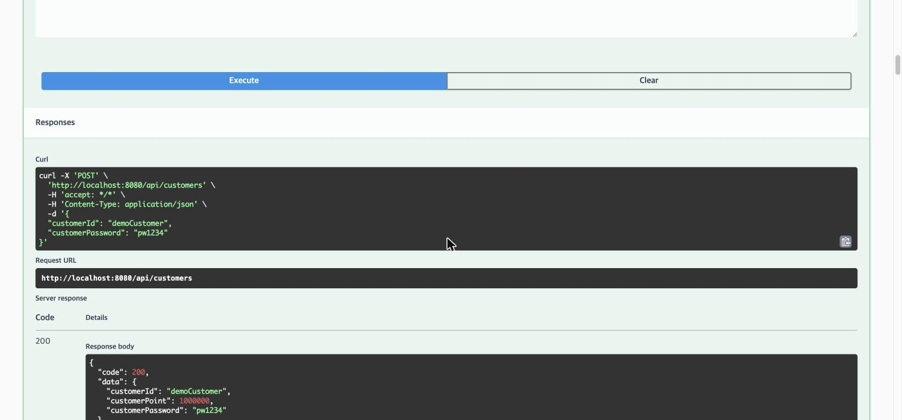

**가입 확인** `GET /api/customers/{customerId}` — 초기 포인트 1,000,000이 지급된 것을 확인했습니다.
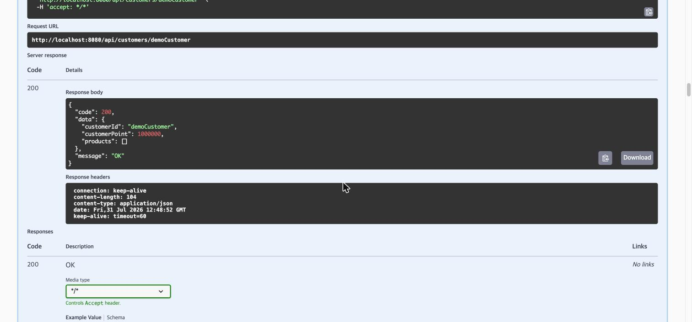

**정보 수정** `PUT /api/customers` (포인트 500,000으로 변경)
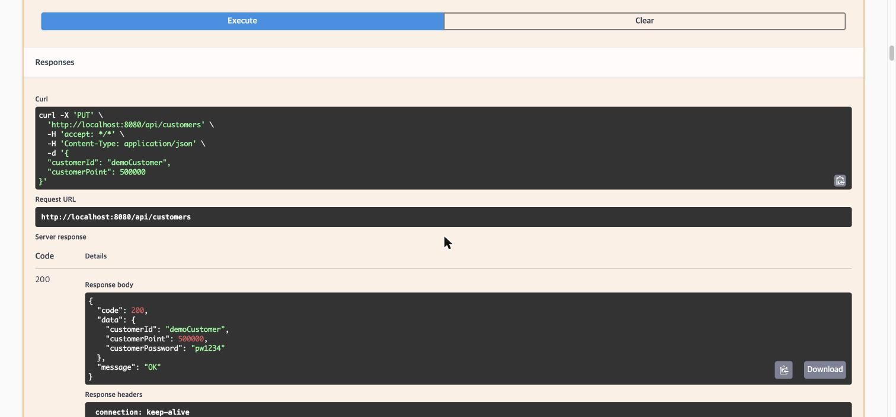

**수정 확인** `GET /api/customers/{customerId}`
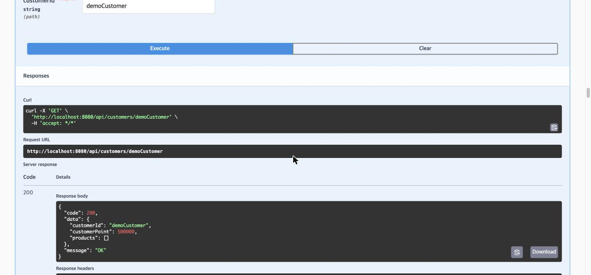

> `Customer` 엔티티는 PDF 설계 지시에 따라 `customerId`·`customerPassword`·`customerPoint` 세 필드로만 구성했습니다. 그런데 PDF의 API 목록에는 이 엔티티에 없는 이름으로 고객을 조회하는 `GET /api/customers/{customerName}` API가 별도로 나열되어 있었고, 경로 패턴도 `GET /api/customers/{customerId}`와 동일해 라우팅이 충돌합니다. 엔티티에 대응하는 필드 자체가 없어 이름 기반 조회는 구현하지 않고 `customerId` 조회만 남겼습니다. 같은 이유로 고객 정보 수정(PUT) API도 식별자를 제외하면 실질적으로 바꿀 수 있는 속성이 포인트뿐이라, 포인트만 수정하도록 구현했습니다.

**삭제** `DELETE /api/customers`


> 회원가입 시 ID/비밀번호가 비어있으면 `ParameterException`(400), ID가 중복되면 `DATA_DUPLICATED`(409)로 거부됨을 확인했습니다.

### 2.3 로그인/인증

로그인 성공 시 `bff-access` 쿠키가 발급되고, 응답 바디의 비밀번호는 `null`로 마스킹됩니다. 이 쿠키는 공통 컴포넌트인 `SessionHandler`가 발급·해석을 전담하는데, 로그인 시 customerId를 쿠키 값으로 인코딩해 내려주고, 이후 요청이 들어오면 쿠키 값을 디코딩해 "지금 요청한 고객이 누구인지"를 알아냅니다. 

주문·취소·장바구니·위시리스트·리뷰 작성처럼 로그인이 필요한 API는 모두 이 방식으로 고객을 식별하며, **별도로 customerId를 요청 파라미터에 넣지 않아도 됩니다.** 다만 현재는 쿠키 값에 서명이나 만료시간 검증이 없는 단순 구현이라, 이후 JWT 기반으로 교체하는 것을 계획하고 있습니다. Swagger UI는 발급된 쿠키를 후속 요청에 자동으로 실어 보냅니다.

**로그인** `POST /api/customers/login`
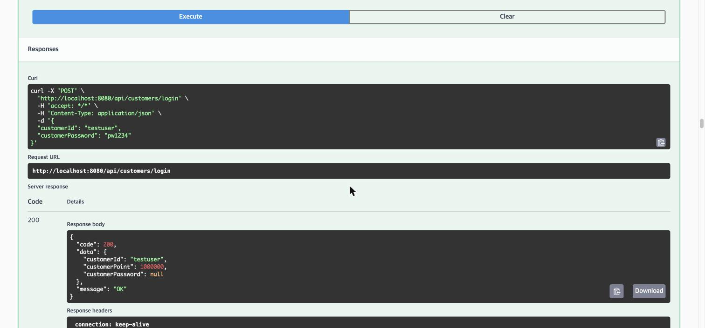

### 2.4 상품 주문 / 주문 취소

주문 시 상품 가격만큼 포인트가 차감되고, 이미 보유 중인 상품을 다시 주문하면 수량이 새로 생기지 않고 기존 수량에 누적됩니다. 취소는 반대로 포인트를 환급하며 수량을 차감하고, 수량이 0이 되면 보유 항목 자체를 삭제합니다. 

두 처리 모두 `@Transactional`로 감싸 포인트와 수량이 항상 일관되게 유지되도록 했습니다. 초기 포인트 1,000,000에서 무선마우스 2개를 주문하면 970,000으로, 그중 1개를 취소하면 985,000으로 정확히 계산되는 것을 확인했습니다.

**주문** `POST /api/customers/order` (무선마우스 2개, 15,000 × 2 = 30,000 차감)


**주문 확인** `GET /api/customers/{customerId}` — 포인트 970,000, 보유 수량 2로 반영되었습니다.
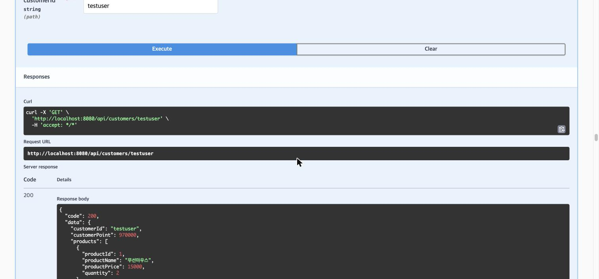

**취소** `POST /api/customers/cancel` (무선마우스 1개 취소, 15,000 환급)
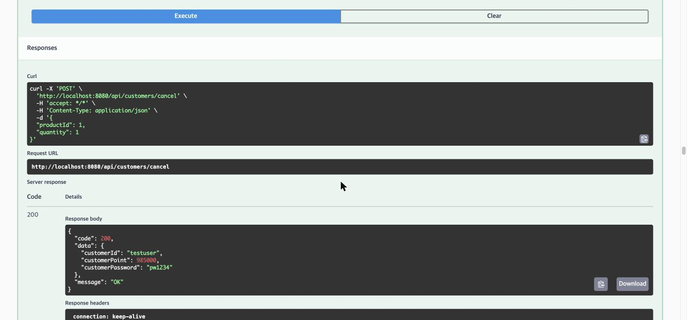

**취소 확인** `GET /api/customers/{customerId}` — 포인트 985,000, 보유 수량 1로 반영되었습니다.
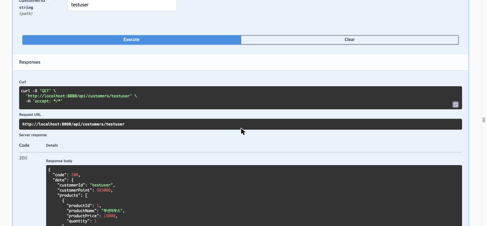

> 로그인 없이 주문 시도 시 `401 Not authenticated`, 포인트 부족 시 `INSUFFICIENT_FUNDS`(400), 보유 수량 초과 취소 시 `INSUFFICIENT_QUANTITY`(400)로 거부됨을 확인했습니다.

---

## 3. 차별화된 기능

### 3.1 장바구니

주문과 별개로 상품을 장바구니에 먼저 담아두고 나중에 한 번에 확정하는 기능입니다. 같은 상품을 다시 담으면 장바구니 수량이 누적되고, 체크아웃을 호출하면 담아둔 항목마다 기존 주문 로직(포인트 차감, 보유 수량 누적)을 그대로 재사용해 실제 주문으로 전환한 뒤 장바구니를 비웁니다. 장바구니에 담고, 실제로 담겼는지 조회로 확인한 뒤, 체크아웃하면 실제 주문(포인트 차감)으로 이어지는 흐름을 검증했습니다.

**담기** `POST /api/customers/cart` (USB허브 1개)
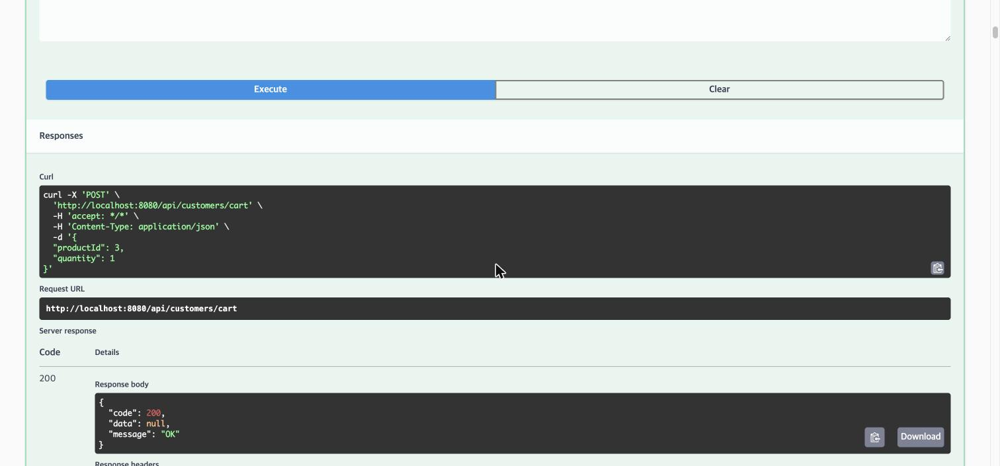

**담기 확인** `GET /api/customers/cart`
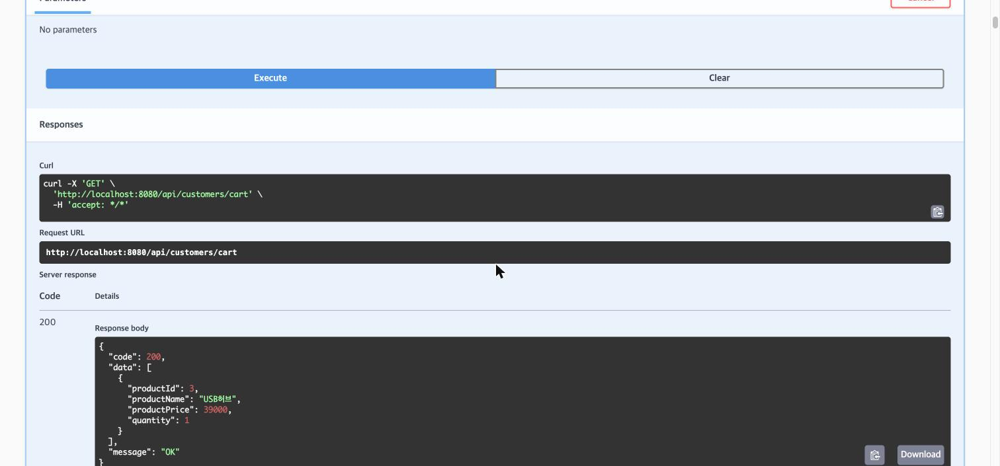

**체크아웃** `POST /api/customers/cart/checkout` — 포인트 985,000 → 946,000(39,000 차감)으로 실제 주문 처리되었습니다.
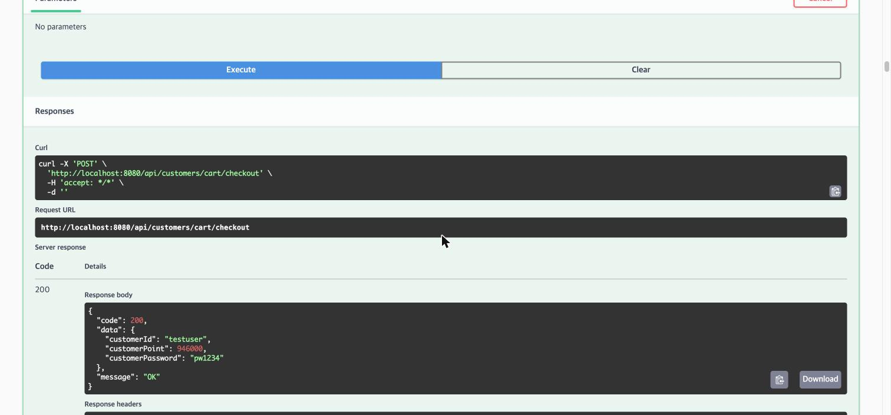

> 체크아웃 후 장바구니가 비워지고, 담아둔 상품이 실제 주문(3-2 이력에도 `ORDER`로 기록됨)으로 전환되는 것까지 확인했습니다.

### 3.2 주문 상세 및 내역 관리

`OrderItem`은 고객이 "현재 보유한 수량"만 나타내는 스냅샷이라 언제 몇 번 주문·취소했는지는 알 수 없습니다. 이를 보완하기 위해 주문/취소/체크아웃이 일어날 때마다 별도의 `OrderHistory` 레코드를 상품명·수량·금액·처리 시각과 함께 남기고, 이 이력을 시간 역순으로 조회하거나 건별 상세로 조회할 수 있게 했습니다.

**이력 목록 조회** `GET /api/customers/{customerId}/orders` — 체크아웃(USB허브 ORDER) → 취소(CANCEL) → 최초 주문(ORDER) 순으로 시간 역순 정렬되었습니다.
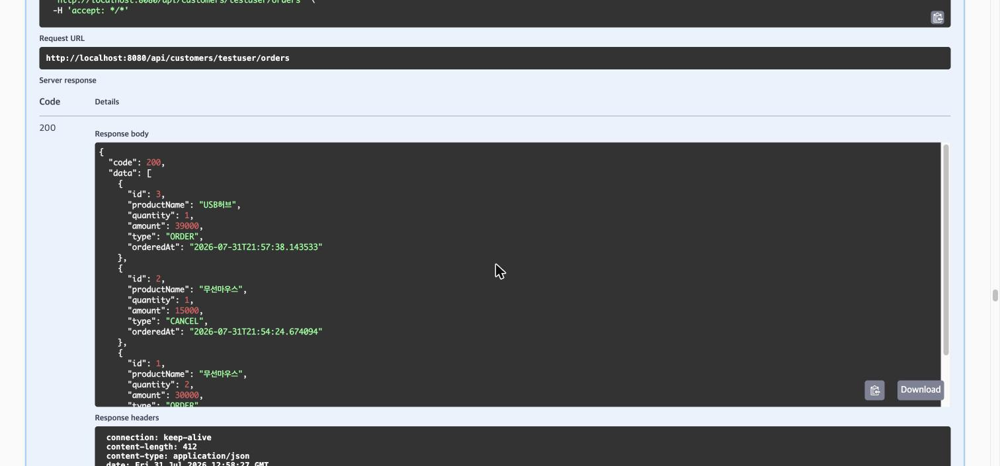

**이력 상세 조회** `GET /api/customers/{customerId}/orders/{orderId}` (id=1, 최초 마우스 주문 건)
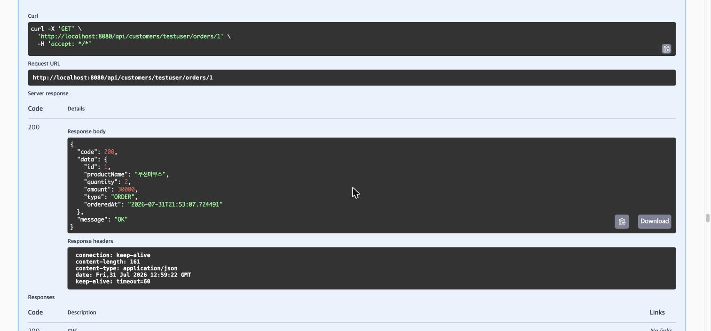

### 3.3 상품 리뷰 및 평점 (구매자 검증 포함)

리뷰 작성은 아무 고객이나 할 수 없고, 해당 상품을 실제로 구매(주문)한 이력이 있는 고객만 가능하도록 제한했습니다. 이때 주문을 취소했더라도 구매했다는 이력(OrderHistory의 ORDER 레코드) 자체는 남아있으므로 리뷰 작성 권한은 그대로 유지됩니다. 

작성 직후 해당 상품의 평균 평점에 정확히 반영되는지 확인했습니다.

**리뷰 작성** `POST /api/products/{productId}/reviews` (무선마우스, 평점 5)
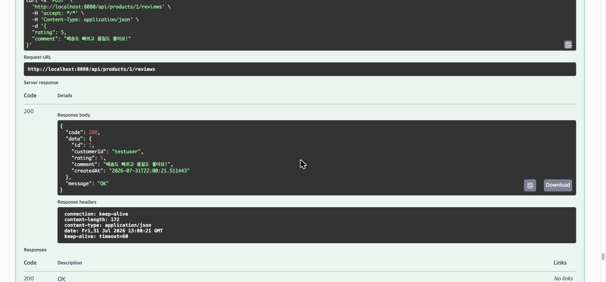

**작성 확인** `GET /api/products/{productId}/reviews` — 평균 평점 5.0으로 반영되었습니다.
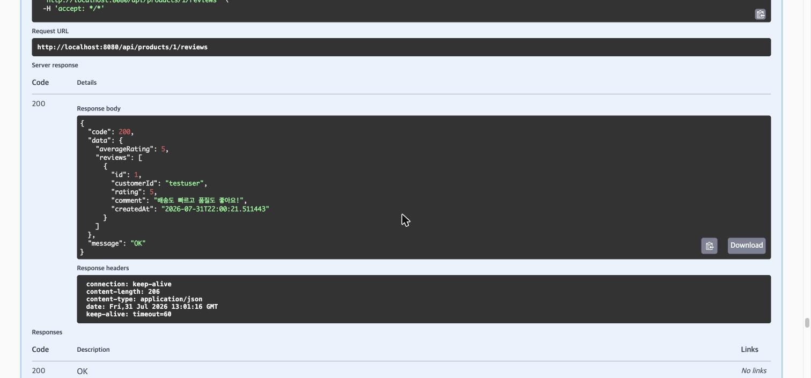

> 구매 이력이 없는 고객이 리뷰 작성을 시도하면 `403 PURCHASE_REQUIRED`로 거부되고, 평점이 1~5 범위를 벗어나면 `ParameterException`(400), 다른 사용자가 남의 리뷰 삭제를 시도하면 `401`로 거부됨도 확인했습니다.

### 3.4 위시리스트/찜하기

고객이 관심 상품을 미리 담아두는 기능으로, 같은 고객이 같은 상품을 중복으로 찜하지 못하도록 고객+상품 조합에 유니크 제약을 걸었습니다.

**찜하기** `POST /api/customers/wishlist` (블루투스키보드)
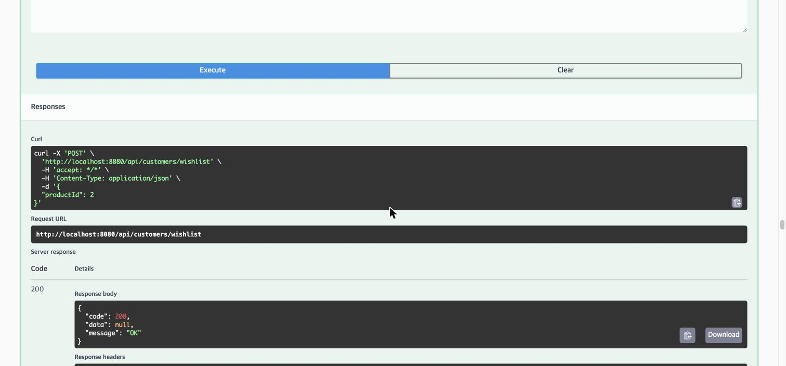

**찜 확인** `GET /api/customers/wishlist`
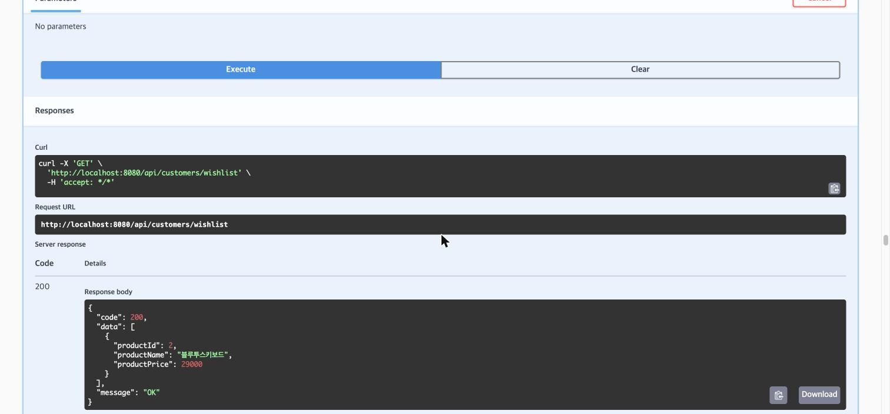

> 동일 상품을 중복으로 찜하면 `409 DATA_DUPLICATED`로 거부됨을 확인했습니다.

### 3.5 카테고리 및 검색

상품에 카테고리를 선택적으로 연결할 수 있게 했고, 검색 API는 키워드와 카테고리ID를 조합해 둘 다 있으면 이름+카테고리로, 하나만 있으면 그 조건만으로, 아무 조건도 없으면 전체 목록으로 결과를 좁혀가는 방식으로 동작합니다. 

카테고리를 만들고 상품에 연결한 뒤, 카테고리 기준으로 검색하면 실제로 필터링되는지 확인했습니다.

**카테고리 등록** `POST /api/categories` ("PC주변기기")
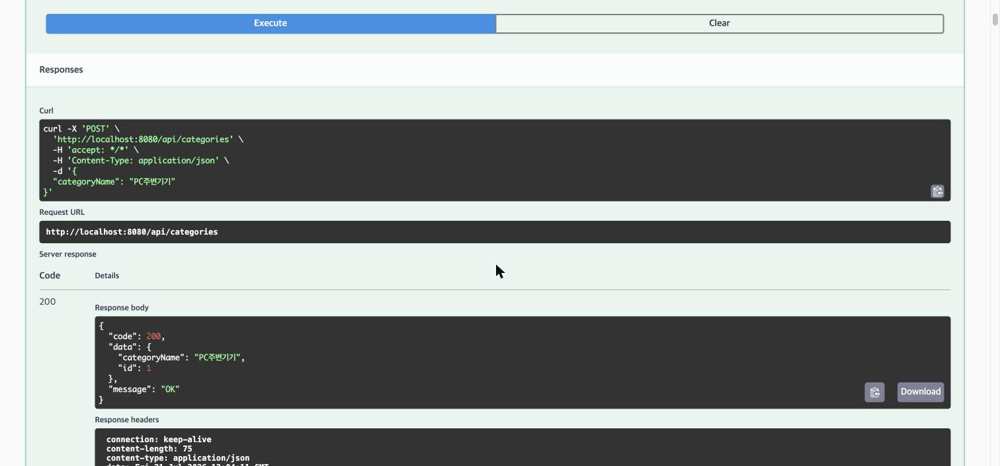

**상품에 카테고리 연결** `PUT /api/products` (블루투스키보드 → PC주변기기, 카테고리 API가 아니라 상품 수정 API로 연결)
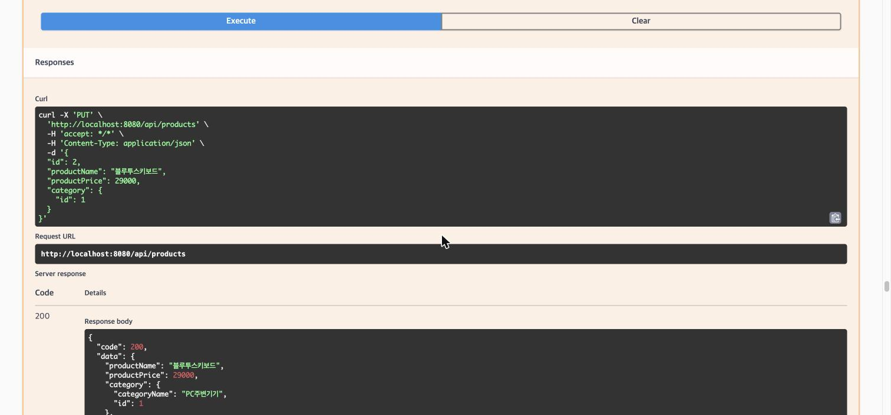

**카테고리 검색 확인** `GET /api/products/search` (`categoryId=1`로 검색 시 블루투스키보드만 조회되었습니다)
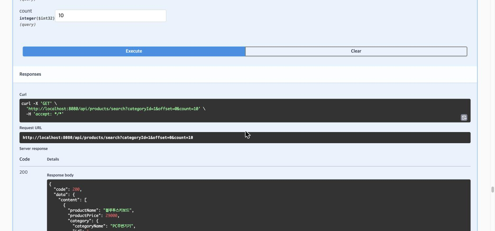

> 카테고리에 연결된 상품이 있는 상태에서 그 카테고리를 삭제하면, 연결된 상품들의 카테고리를 먼저 `null`로 풀어준 뒤 삭제하도록 처리해 FK 제약 위반 없이 안전하게 삭제됨을 확인했습니다 (트러블슈팅 4.3 참고).

---

## 4. 트러블슈팅

구현 과정에서 실제로 발견하고 해결한 이슈들입니다. 단순 기능 구현을 넘어, Spring Boot 4.1.0이라는 최신 버전 스택에서 발생하는 호환성 문제와 실제 런타임 버그를 진단하고 고친 과정을 정리했습니다.

### 4.1 Spring Boot 4.1.0 호환성 이슈

- **`spring-boot-starter-aop` 제거**: Spring Boot 4.x부터 해당 스타터가 더 이상 게시되지 않아(Maven Central 확인 결과 최신 버전이 4.0.0-M2에서 끊김), `org.aspectj:aspectjweaver`를 직접 의존성으로 추가해 AOP 로깅을 구현했습니다.
- **springdoc-openapi 버전 불일치**: `springdoc-openapi-starter-webmvc-ui:2.3.0`은 Spring Boot 3.x(Spring Framework 6) 대상이라 Boot 4.1.0(Framework 7)에서 `NoSuchMethodError`가 발생했습니다. Boot 4를 지원하는 `3.0.3`으로 업그레이드해 해결했습니다.
- **H2 콘솔 자동설정 제거**: Boot 4.x에서 `H2ConsoleAutoConfiguration` 클래스 자체가 제거되어 `spring.h2.console.enabled=true` 설정만으로는 콘솔이 뜨지 않았습니다. `config/H2ConsoleConfig`에서 서블릿을 직접 등록해 해결했는데, H2가 기본 제공하는 `WebServlet`은 옛날 `javax.servlet` 기반이라 Jakarta 컨테이너(Tomcat 10+)에 등록할 수 없어, H2가 별도 제공하는 `JakartaWebServlet`을 사용했습니다.

### 4.2 Hibernate 프록시 직렬화 노출

장바구니 체크아웃처럼 같은 트랜잭션 안에서 지연 로딩 연관관계를 먼저 조회한 뒤 같은 엔티티를 다시 조회하면, 영속성 컨텍스트가 이전에 만든 Hibernate 프록시 인스턴스를 그대로 반환해 `hibernateLazyInitializer` 같은 내부 필드가 JSON 응답에 노출되는 문제를 발견했습니다. `jackson-datatype-hibernate6`로 해결하려 했으나 프로젝트가 사용하는 Hibernate 7과 호환되지 않아, Jackson에 `Object.class` 대상 `@JsonIgnoreProperties` 믹스인을 전역 등록해 해결했습니다.

### 4.3 카테고리 삭제 시 FK 제약 위반

상품이 참조 중인 카테고리를 삭제하면 H2가 `Referential integrity constraint violation`을 던지며 500 에러가 발생했습니다. `CategoryService.deleteCategory`에서 삭제 전 연결된 상품들의 카테고리를 모두 `null`로 풀어준 뒤 카테고리를 삭제하도록 수정했습니다.

### 4.4 장바구니 조회의 고객 존재 검증 누락

`CartService.getCart()`가 다른 장바구니 API(담기/제거/체크아웃)와 달리 고객 존재 여부를 확인하지 않고 바로 조회부터 수행했습니다. H2가 인메모리라 서버 재시작 시 고객 데이터가 사라지는데, 만료 없는 세션 쿠키가 브라우저에 남아있으면 존재하지 않는 고객의 조회가 "빈 배열 + 200"으로 성공해버리는 불일치가 있었습니다. `getCart`에도 동일한 고객 존재 검증을 추가해 다른 API와 일관되게 `404`를 반환하도록 수정했습니다.

### 4.5 신규 엔티티(Long) 저장 시 `StaleObjectStateException`

상품 등록 시 신규 엔티티의 `id`를 `0L`로 세팅하면 Spring Data JPA의 `save()`가 boxed `Long` 타입에서는 "기존 엔티티"로 오인해 `merge()`를 시도하다 존재하지 않는 행을 찾지 못해 예외가 발생했습니다. `id`를 `null`로 세팅해 `persist()` 경로를 타도록 수정해 해결했습니다.
